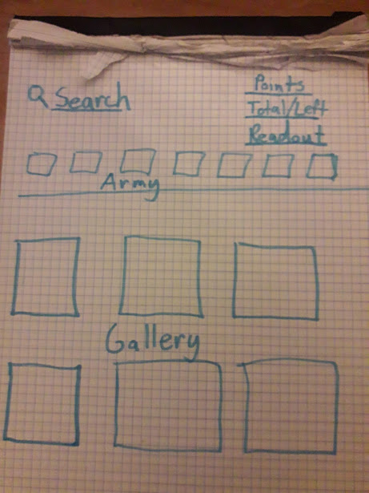
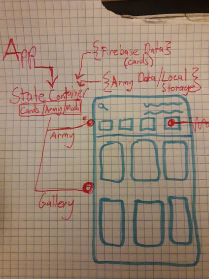
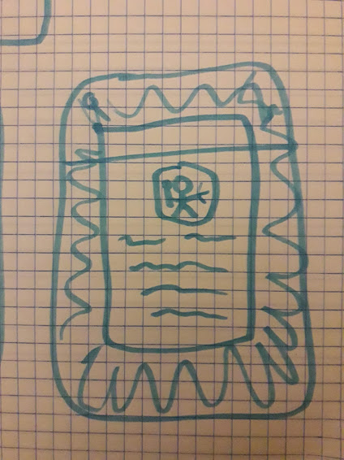
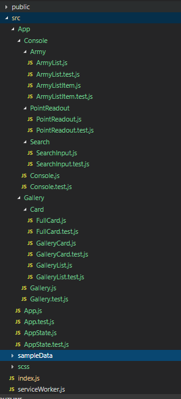
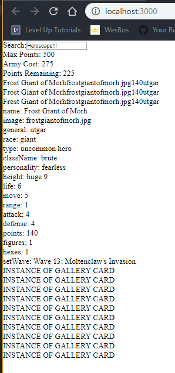

## Crafting a User-Interface

If you didn't know, create-react-app v2 came out recently. So all the cool kids are making web apps and UI right now.

Let's build one too! [Snag my code if you want to code along!](https://github.com/Dissolutio/heroscape-armory.git) If you want to do the starter, just delete the `src` directory and rename the `src.starter-files` to `src`.

### The mission

There is a boardgame, called Heroscape, that is a turn based strategy board game. Each player assembles an army of figurines, and each of these figurines has a card associated with it.

This card has all the stats for the unit, and searching through all the cards can be a pain, especially if they have been lost or damaged.

Our app will present the cards of Heroscape, and allow a user to choose which ones they want in their army. Very simple, but adventure awaits for the novice developer!

### The method

The React documentation is marvelous, and has a section called [Thinking in React](https://reactjs.org/docs/thinking-in-react.html), where they break down how to approach
designing your UI.

1. [Start with a mock](#step1)

2. [Break the UI into a component hierarchy](#step2)

3. [Build a Static Version in React](#step3)

4. [Identify the Minimal (but complete) Representation of UI State](#step4)

5. [Identify where your state should live](#step5)

6. Add inverse data flow

<h2 id="step1">Start with a mock</h2>

Up top, we have a search bar, a point readout, and the army cards the user has chosen.
Down below, the gallery of cards for browsing.


I only imagine people using this app on their phones, so that is definitely what I'm gearing for.

When they want to view a card, I want a modal so they can see all the data.


**Our data** will be an array of objects. Each object will look like this:

<details>
<summary>Our card/unit object</summary>

```js
{
  name: 'Frost Giant of Morh',
  image: 'frostgiantofmorh.jpg',
  general: 'utgar',
  race: 'giant',
  type: 'uncommon hero',
  className: 'brute',
  personality: 'fearless',
  height: 'huge 9',
  life: '6',
  move: '5',
  range: '1',
  attack: '4',
  defense: '4',
  points: '140',
  figures: '1',
  hexes: '1',
  setWave: "Expansion Set",
  abilities: [
    {
      name: '1st',
      desc: '1st',
    },
    {
      name: '2nd etc.',
      desc: '2nd etc.',
    },
  ],
}
```

</details>

<h2 id="step2">Break the UI into a component hierarchy</h2>

My app has two sections, the Army stuff up top, and the Gallery down below. There will be a modal, but I will put that as part of the Gallery:

1. Army area:

   - Army List
   - Army List Item
   - Point Readout
   - Search Input

2. Gallery area:

   - Gallery List
   - Gallery List Item
   - Modal
   - Detailed Card (for Modal)

<h2 id="step3">Build a static version in React</h2>

The react docs sum it up well:

<blockquote>
The easiest way is to build a version that takes your data model and renders the UI but has no interactivity. It’s best to decouple these processes because building a static version requires a lot of typing and no thinking, and adding interactivity requires a lot of thinking and not a lot of typing.
</blockquote>

So it's time to build now, just a real simple skeleton with no State...

Now, I'm not sure if it's standard, but I like the directory structure of my project to make it obvious how the program flows. For a really big project I'm sure this might go out the window. I'm also going to go ahead and make test files next to each component, though I will only start them with the same simple test Create-React-App gives me for free (I'm really new to testing):

```js
// EveryComponent.test.js
import React from 'react'
import ReactDOM from 'react-dom'
import App from './App'

it('renders without crashing', () => {
  const div = document.createElement('div')
  ReactDOM.render(<App />, div)
  ReactDOM.unmountComponentAtNode(div)
})
```



And it isn't pretty, but here is everything rendering in the browser (Hooray!):



<h2 id="step4">Identify the Minimal (but complete) Representation of UI State</h2>

Our App State will include:

- All the Heroscape Cards (the Library, could be expanded and editable in future versions)
- A search input value
- The filtered Heroscape Cards to display

- Army (the cards in the army , the maximum point value allowed)
- Modal (on/off , which card to show )

<h2 id="step5">Identify Where Your State Should Live</h2>

I will be accessing army and gallery related State from both the Army and Gallery component trees. So I reckon we better make a State Container above both of these components, so they can share without fuss. This will keep our code the cleanest, and make it easier to extend it later.

Hungry for more? Join me in the [next round where we build this puppy!](/posts/heroscape-armory/building)
