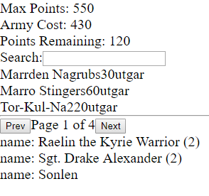

## Adding State Methodically

First, in the `AppState` component, I will initialize the army state as an empty object, and the cards as an empty array. Then I will pass that down as props to the lower components. I want to make sure that all the components respond predictably to an empty object/array (which are NOT falsy, they are TRUTHY!):

So check for an array like so:

```js
// arrayProp = []

if (!this.props.arrayProp.length) {
  return <LoadSpinner>
}
render() {
  <p>Array has arrived!!!</p>
}
```

And to conditionally render on presence or absence of an object property:

```js
// armyProp = {}

const { property1, property2 } = props.armyProp;
const propertyToDisplay = property1 && property1.doStuff();
```

## Add some real State

As I'm moving along, I will hookup the props to come from state, check that the component doesn't freak out with empty props, and then go back to state and add the state after a timeout. This way I can see each component respond to the state changing:

```js
// in AppState.js
componentDidMount = () => {
  setTimeout(() => {
    this.setState(
      { cardsToDisplay: sampleCardArray },
      console.log("CardsToDisplay Loaded!")
    );
  }, 3000);
};
```

So voila, our components don't crash when state is empty, and update just fine when state is loaded:




## The search input

Handling inputs is a basic React requirement:

In our state container initialize the search value as an empty string, and create a method to handle the OnChange event.

```js
// in AppState.js

this.state = {
  army: {},
  gallerySearchValue: "",
  cards: [],
  cardsToDisplay: [],
};

gallerySearchChange = (e) => {
  e.preventDefault();
  this.setState({ gallerySearchValue: e.target.value });
};
```

Then pass this handler down to the input that needs it.</summary>

```js
// in AppState.js
render() {
  return (
    <div>
      <Console army={this.state.army} gallerySearchChange={this.gallerySearchChange} />
  );
}

// in Console.js
export default props => {
  return (
    <div>
      <SearchInput gallerySearchChange={props.gallerySearchChange} />
    </div>
  );
};

// in SearchInput.js
export default props => {
  const { gallerySearchChange } = props;
  return (
    <form onSubmit={() => console.log('Form Submitted!')}>
      <label htmlFor="search">
        Search:
        <input type="text" onChange={gallerySearchChange} name="search" />
      </label>
    </form>
  );
};
```

## Build a Modal

In my state container, I will have a method and the state for toggling the modal, and setting which card to display in the modal:

```js
toggleModalCard = (event, card) => {
  if (!card) {
    card = {};
  }
  this.setState({
    modalCard: {
      on: !this.state.modalCard.on,
      card: card,
    },
  });
};
```

1. There are over 200 heroscape cards, so when they load up we cannot just show 200 cards with thumbnails on someone's screen. To keep the app snappy, we must [create a Pagination component, which I cover in this React post!](/posts/react/paginator)

2. We must initialize firebase in our React App, as that is where I am storing the card data, as well as the card portrait thumbnails. [This is also covered in its own post!](/posts/react/adding-firebase)

3. We have to style this thing so that it is easy to use, and purty to look at!
