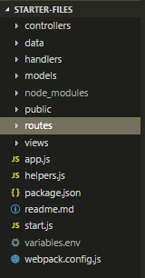

## SetUp

Here's the skinny on the boilerplate.

### Initial Downloads

The starter files are hosted in a by [Wes Bos](https://wesbos.com/), on github. He created the [course of videos](https://learnnode.com) that I'll be using for learning node, and he also puts out a [freaking amazing podcast](https://syntax.fm/) with Scott Tolinski (whom I also subscribe to at his [Level Up Tutorials](https://www.leveluptutorials.com/) course platform)

We host our database at [mlab](https://mlab.com/), and use [mongoDB Compass](https://www.mongodb.com/products/compass) as a GUI to manage our database.

Other than that, we get our database credentials from mlab, pop them into our variables.env file (which I've learned will hold variables we need to use, but do not ever need to show the public), then run `npm install` and then `npm start` and sure enough localHost7777 has some good news: "Hey it works!".

### Familiarize with the Codebase

Our directory structure looks like so:



### The unknown

We don't quite know what the `controllers` or `models` directories will hold, but they both have a `.gitkeep` file in them, which in itself is a cool trick to know.

`handlers` seems to be for error handling, `data` holds sample data JSON and some functions for importing the sample data or clearing the sample data out.

### The known

Our `views` folder holds our [Pug](https://pugjs.org/api/getting-started.html) templates.

The `package.json` file and `app.js` reveal most of our tooling. We will be using [mongoose](http://mongoosejs.com/) for interacting with MongoDB. [Express](https://expressjs.com/) is our Node framework (we we shall see what this means). There is a lot of other middleware in the app.js file, and the app.js file itself seems to decribe a flow of some kind from top to bottom.

In `start.js` it checks your Node version, then imports environmental variables like so:

```js
require('dotenv').config({ path: variables.env })
```

so that later it knows where to look when you do:

```js
mongoose.connect(process.env.DATABASE)
```

And then it connects to your database, handles errors, and fires up port 7777. Webpack will be bundling our JS files and compiling our SASS.

We're ready to learn some [Core Concepts on day 2](/posts/learning-node/core-concepts) of NodeJS!
