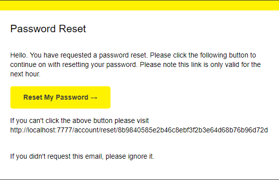

We sign up for mailtrap.io, so we can have a test inbox to send emails to.

In our code, we will make a handler file for sending emails. Then, when we want to use this functionality, we can just feed it some variables and a pug template and BAM! Email.

We will call this code from our password reset flow. Let's roll.

## Create a new handler file:

```js
// handlers/mail.js
const nodemailer = require('nodemailer')
const pug = require('pug')
const juice = require('juice')
const htmlToText = require('html-to-text')
const promisify = require('es6-promisify')
```

We will use all of these soon, but at first we are just going to use the first import, to make sure its all working. Then we will fine tune it.

From my mailtrap account I stored the needed variables in my `process.env` file. Naturally, I mispelled PORT as POST for a long time which had me troubleshooting all the wrong things. Ah, programming :)

In our handler, we make this cool transport, and then we go ahead and load it and fire it:

```js
// handlers/mail.js
var transport = nodemailer.createTransport({
	host: process.env.MAIL_HOST,
	port: process.env.MAIL_PORT,
	auth: {
		user: process.env.MAIL_USER,
		pass: process.env.MAIL_PASS,
	},
});

transport.sendMail({
  from: 'John M. <noreply@delicious.com>',
  to: 'FakeMan@example.com',
  subject: 'Password reset',
  html: 'I <strong> love </strong> you!'
  text: 'I **love** you :)'
})
```

## Check that it works

So to make sure we have it configured right, we are just going to call this function from `start.js`.
We do this by adding this line at the end of the file:

```js
require('./handlers/mail);
```

And as soon as we hit save it should fire the email. I got stuck here for a bit.

## Add email functionality to password reset flow

Now, in authController, we don't want to flash the `${resetURL}` to the user anymore. So remove that from the success flash, and add the following:

```js
// authController.js
const mail = require('../handlers/mail')
// ...
// ...
const resetURL = `http://${req.headers.host}/account/reset/${
  user.resetPasswordToken
}`
await mail.send({
  user,
  subject: 'Password Reset',
  resetURL,
  filename: 'password-reset',
})
req.flash('success', `You have been emailed a password reset link.`)
res.redirect('/login')
```

## Fine tune the email

So now authController is passing our mail handler some needed info. It says to use the file `password-reset`, but our mail handler doesn't know anything about that file. Let's change that by adding this function before our export:

```js
// handlers/mail.js
const generateHTML = (filename, options = {}) => {
  const html = pug.renderFile(
    `${__dirname}/../views/email/${filename}.pug`,
    options
  )
  const inlineStyleHTML = juice(html)
  return inlineStyleHTML
}
```

We use the `pug` import to render the file into html, we employ the handy `__dirname` to find the file no matter where we are (local, or server), and `juice` takes our styles and inlines them so any email client will hopefully display the email correctly.

Let's reform our sending function:

```js
exports.send = async options => {
  const html = generateHTML(options.filename, options)
  const text = htmlToText.fromString(html)
  const mailOptions = {
    from: 'John M. <noreply@delicious.com>',
    to: options.user.email,
    subject: options.subject,
    html,
    text,
  }
  const sendMail = promisify(transport.sendMail, transport)
  return sendMail(mailOptions)
}
```

Wes Bos already made us a nice `password-reset.pug` file,
and when we get it in our mailtrap, it's beautiful!



In [#18 we check out how to lock down our application with user permissions!](/posts/learning-node/user-permissions)
