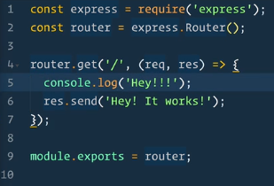
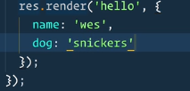
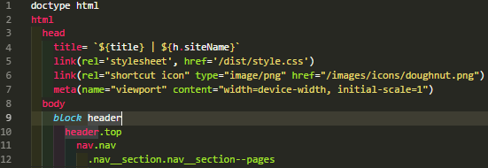
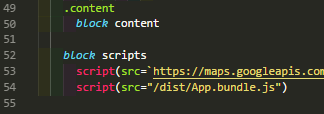
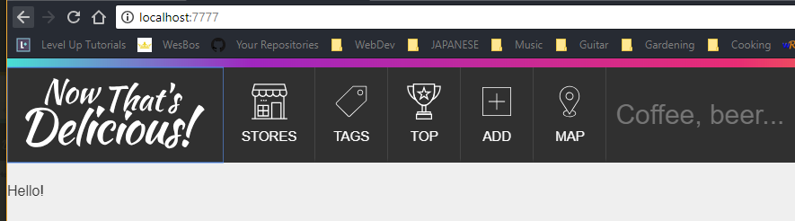
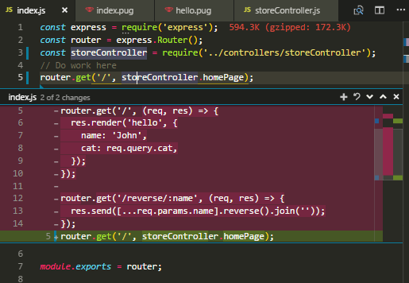
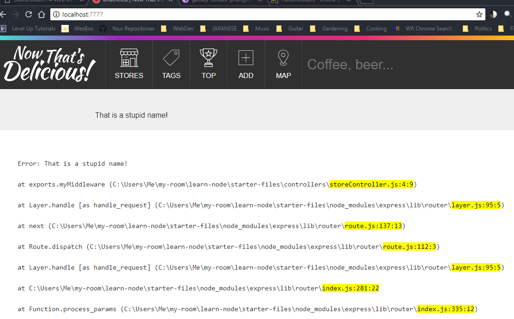

## Overview

The coding of the course begins with five sections over:

- <a href="#routing">Routing</a>
- <a href="#templating">Templating</a>
- <a href="#template-helpers">Template Helpers</a>
- <a href="#controllers-mvc">Controllers and MVC Pattern</a>
- <a href="#middleware-error">Middleware and Error Handling</a>

<h3 id="routing">Routing</h3>

We have these two lines in our `app.js` file:

```js
const routes = require('./routes/index')

app.use('/', routes)
```

And then our `routes/index.js` file looks like:


You can see how the router is acting on two arguments, `req` and `res`, the **REQ**uest from the client, and the **RES**ponse from us, the server.

Query parameters are in the request. So if the URL is

`localhost:7777/?name=John&age=28`, then:

```js
req.query.name = 'John'
req.query.age = '28'
```

And you could shoot that data back to the client either as is, or as JSON with either:

```js
res.send(req.query)
res.json(req.query)
```

The magic of getting these params from the URL happens in our `app.js` file with these lines:

```js
app.use(bodyParser.json())
app.use(bodyParser.urlencoded({ extended: true }))
```

The [expressJS docs](https://expressjs.com/en/guide/routing.html) would offer more information on what is possible with routing.

<h3 id="templating">Templating</h3>

We will often use, in our routing:

```js
res.render('name-of-template', someOtherVariables)
```

This tells our app to render a Pug template. Pug offers looping and logic and advanced templating and mix-ins.

You can get information from your route, to your template.
Simply pass an object in as the someOtherVariable:

And then reference the keys of this object inside of `#{}` to insert the value into your template.
You could make this dynamic by changing the value of dog to be
`dog: req.query.dog` and then it would be passed in through your URL query.

One hangup : You can't use the `#{}` in an html attribute, like this:

```pug
//- you can't do this
img.dog(src="dog.jpg" alt=#{dog})
```

You can only use it in text. So the workaround is using template literals, since Pug is actually javascript before being processed into html:

```pug
//- you have to do this
img.dog(src="dog.jpg" alt=`Dog ${dog}`)
```

You can do javascript inside Pug if you need to with just a minus sign, though it's not ideal:

```pug
- const upDog = dog.toUpperCase();
p Hello my dog's name is #{upDog}
```

Or you could do

```pug
p Hello my dog's name is #{dog.toUpperCase()}
```

### Extending Layouts

In our `views` folder we have a `layout.pug` file. This file has stuff we want included on most pages, like our title and html and meta tags.


Notice this in `layout` also, but there is no content beneath it:


How it works is that when we render `layout`, it will use the header content written after `block header` as the default for that 'block'. We can extend this layout in another template, such as our `hello.pug` file, and then just add the blocks we want to and use while defaulting to the blocks from `layout.pug` if we prefer.

So,you make your `hello.pug` go like this:

```pug
extends layout
  block content
    p Hello!
```

And then it looks so pretty! Other people's CSS amazes me; in time I hope to make simple things
so beautiful.


<h3 id="template-helpers">Template Helpers</h3>

#### Import them

In `app.js` we have:

1.  At the top:

    ```js
    const helpers = require('./helpers')
    ```

2.  In middleware land:
    ```javascript
    // pass variables to our templates + all requests
    app.use((req, res, next) => {
      res.locals.h = helpers
      res.locals.flashes = req.flash()
      res.locals.user = req.user || null
      res.locals.currentPath = req.path
      next()
    })
    ```

#### Use Them in Pug

In `layout.pug` we have:

1.

```pug
title=`${title} | ${h.siteName}\`
```

and this

2.

```pug
each item in h.menu
  li.nav__item
    a.nav__link(href=item.slug, class=(currentPath.startsWith(item.slug) ? 'nav__link--active' : ''))
      != h.icon(item.icon)
      span #{item.title}
```

- The `!=` above [is unescaped buffered code](http://jade-lang.com/reference/code), and uses this function from `helpers.js`:

  ```js
  // inserting an SVG
  exports.icon = name => fs.readFileSync(`./public/images/icons/${name}.svg`)
  ```

  I'm not sure of the mechanics of this, but it seems the `layout.pug` file is setting `a.nav__link` equal to some kind of unescaped html generated by `fs.readFileSync`.

Also, in item 2 above, notice that ternary usage :

```js
class=(currentPath.startsWith(item.slug) ? 'classNameToUse' : '')
```

That's pretty cool!

#### Res.render({params}) => dataForPugLayout

In your `res.render()` function in `routes.js`, you can pass a timestamp of some kind on the parameter object, and then access that timestamp in your pug file, and manipulate it there! Like so:

1.  In `routes/index.js`:
    ```js
    router.get('/', (req, res) => {
      res.render('hello', {
        title: 'Home Screen',
        timestamp: new Date(),
      })
    })
    ```
2.  In `hello.pug`
    ```pug
    h2 Sale ends in #{h.moment().endOf('day').fromNow(timestamp)}
    ```

<h3 id="controllers-mvc">Controllers and the MVC Pattern</h3>

- Model = the thing that gets data
- View = the templates
- Controller = puts data into templates, traffic cop

In the following screenshot of my code changes, you see that we added
a `require` statement for the `storeController`, and offload the work and code away from `index.js`.


And here we yield a simple checkpoint for our brand new `./controllers/storeController.js` file:

- ```js
  exports.homePage = (req, res) => {
    res.render('index')
  }
  ```

Which in turn calls for another brand spankin' new file: `./views/index.pug`
and this Puggy-Poo barks like this:

- ```pug
  extends layout
  block content
      p Hi!
  ```

<h3 id="middleware-error">Middleware and Error Handling</h3>

#### Handing off the route from controller to controller

Let's say we add another export to our `storeController`:

```js
exports.myMiddleware = (req, res, next) => {
  req.name = 'John'
  next()
}
exports.homePage = (req, res) => {
  res.render('index')
}
```

and we implement both of these exports in our `routes/index.js` file:

```js
router.get('/', storeController.myMiddleware, storeController.homePage)
```

then if in `storeController.exports.homePage` we `console.log(req.name)` it will output `'John'`.

#### How much middleware?

We are already passing our `req` down through **a bunch** of middleware, in `app.js`, before it even gets to our routes. Just go look. It's like your first time with a `package.json` you're just like "What **is** all this crap?!"

That's what all the `app.use()` calls are, is middleware.

Then after `app.use('/', routes);`, we get to our `errorHandlers`!

We can try them out, and get a taste of their use by adding to our `storeController.exports.myMiddleware` and making it look like this:

```js
exports.myMiddleware = (req, res, next) => {
  req.name = 'John'
  if (req.name === 'John') {
    throw Error('That is a stupid name!')
  }
  next()
}
```

and upon refresh we see:

a **very refreshing** error :)

[On to the next tutorials, we focus on database storage and how we model our data in a 'schema'!](/posts/learning-node/models)
