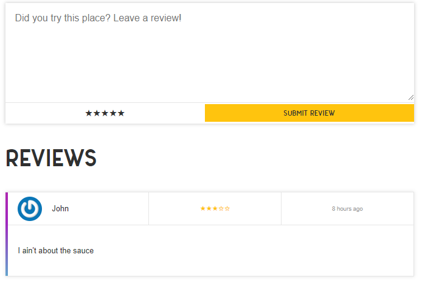

## Display our Reviews

We want to display the reviews for each store at the bottom of its store page. But how to keep track of this relationship, do we store it and query it from our review document, or the store document?

## Virtual fields on our store model

We will add the following virtual fields, near the end of our `store.js` file. You can see the basic flow here, the field will be named 'reviews', and the store.\_id of our store object will guide us to the Review that has that ObjectId as its 'store' field.

```js
// models/store.js
storeSchema.virtual('reviews', {
  ref: 'Review',
  localField: '_id',
  foreignField: 'store',
})
```

We have to tell mongoose when to populate the virtual field, so we will tell it to do so in 2 cases.
In the actual Schema, after the fields object, we insert a new object as an argument to `mongoose.Schema`:

```js
// models/store.js
const storeSchema = new mongoose.Schema(
  {
    // object of field objects
  },
  {
    toJSON: { virtuals: true },
    toObject: { virtuals: true },
  }
)
```

So now we can get the reviews off of our store. You can use `res.json()` from your controller and then `pre=h.dump` in your pug file to make sure you are recieving the data.

## autopopulate fields

You will notice that the author field, on our review field of our store, is not a name yet. It is the User.\_id number. Let us add a little middleware function that tells mongoose to populate the author field with the actual name. We then tell mongoose to do this as a 'pre' action.

```js
// models/Review.js
// after reviewSchema...

function autoPopulate(next) {
  this.populate('author')
  next()
}

reviewSchema.pre('find', autoPopulate)
reviewSchema.pre('findOne', autoPopulate)
```

We must also tell the storeController to

## Pug mixin: review

Now we are ready to display our review! Let's make a mixin, and then include it in our store view!

Check out our sweet use of moment.js (time/date library)!
It will say things like 'a minute ago' or '2 weeks ago' etc.

```pug
views/mixins/_review.pug
mixin review(review)
  .review__header
    .review__author
      img.avatar(src=review.author.gravatar)
      p= review.author.name
    .review__stars(title=`Rated ${review.rating} out of 5 stars`)
      = `★`.repeat(review.rating)
      = `☆`.repeat(5 - review.rating)
    time.review__time(datetime=review.created)= h.moment(review.created).fromNow()
  .review__body
    p= review.text
```

And include it:

```pug
//- views/store.pug
include mixins/_review

//- down at bottom
if store.reviews
  .reviews
    each review in store.reviews
      .review
        +review(review)
```

Isn't it beautiful?!



In video 39 of this course (we are SO CLOSE!) [we explore advanced aggregations!](/post/learning-node/advanced-aggregations)
