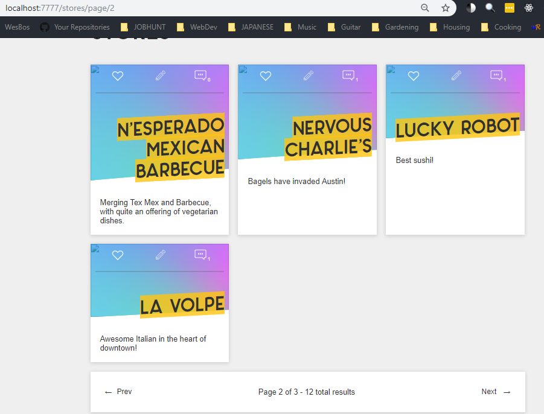

## Overview

So, on our home page and elsewhere, we query the database for all the stores, but if we have a lot of stores, then rendering them all could get out of hand. We want the app to load quickly!

Pagination is the art of busting the data into chunks, and displaying it one page at a time. I will be using this right away in another project, and I imagine it will be a common practice for any developer.

Let's do it:

## Hit a route

```js
router.get('/stores/page/:page', catchErrors(storeController.getStores))
```

We already have a route for `/` and `/stores`. They all get handled by `storeController.getStores`:

## The heart of the matter

We get which page the user is on from the URL `:page` parameter, and default to page 1. We want to display 4 stores per page.

```js
exports.getStores = async (req, res) => {
  const page = req.params.page || 1
  const limit = 4
  const skip = page * limit - limit
  const storesPromise = Store.find()
    .skip(skip)
    .limit(limit)
    .sort({ created: 'desc' })
  const countPromise = Store.count()
  const [stores, count] = await Promise.all([storesPromise, countPromise])
  const pages = Math.ceil(count / limit)
  // skip is falsey on page 1 so...
  if (!stores.length && skip) {
    req.flash(
      'info',
      `Hey! You asked for page ${page}. But that doesn't exist. So this is page ${pages}`
    )
    res.redirect(`/stores/page/${pages}`)
    return
  }
  res.render('stores', { title: 'Stores', stores, page, pages, count })
}
```

## Make a mixin and include it

```pug
//- views/mixins/_pagination.pug
mixin pagination(page, pages, count)
  .pagination
    .pagination__prev
      if page > 1
        a(href=`/stores/page/${page - 1}`) Prev
    .pagination__text
      p Page #{page} of #{pages} - #{count} total results
    .pagination__next
      if page < pages
        a(href=`/stores/page/${parseFloat(page) + 1}`) Next
```

```pug
//- views/stores.pug
include mixins/_pagination
.inner
  h2= title
    .stores
      each store in stores
        +storeCard(store)
    +pagination(page, pages, count)
```

Presto, it works great and now we can see it is working:



## End of tutorial

Well, [Wes Bos is the creator of this course](https://www.wesbos.com/), and in the next four videos lessons (#41-#44) he shows you how to publish your project to the web. I deployed to Now, he also shows you Heroku and Digital Ocean Linux.

There are a few things I want to fix or change in this app, like adding pagination for the tags page, hiding the password reset fields on the user object (right now I notice that hanging all willy nilly), and also I notice that we cleanup the user input when we register them, but not when we log them in so eventhough I can register with "My.Name@gmail.com" I have to login with "myname@gmail.com" typed exactly like that. And of course, I am going to load a bunch of Austin, TX restaurants!

I encourage you to also hack and practice and create and experiment with all the new Node knowledge! Good luck!
