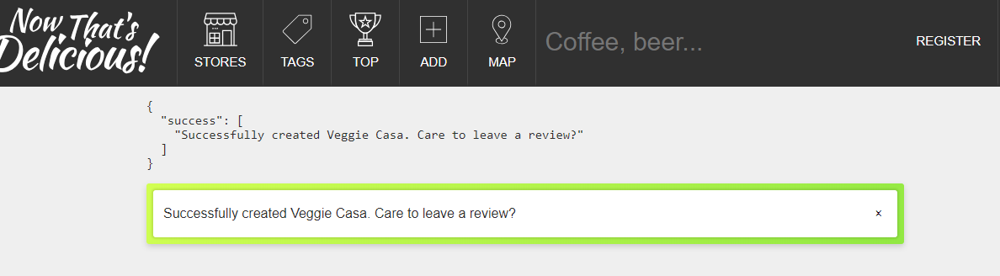
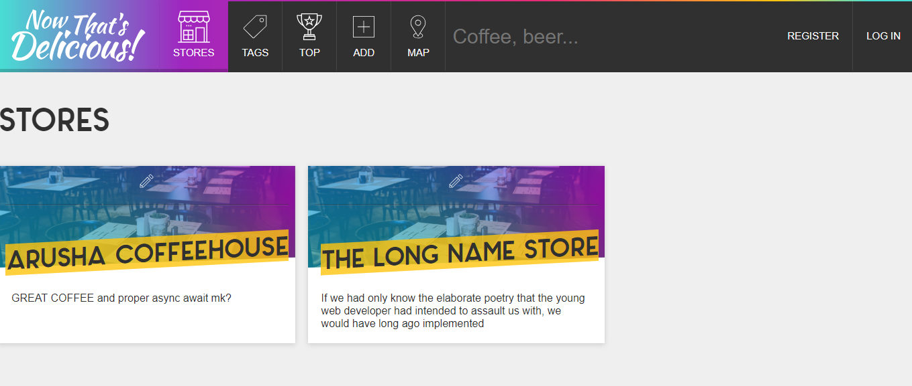
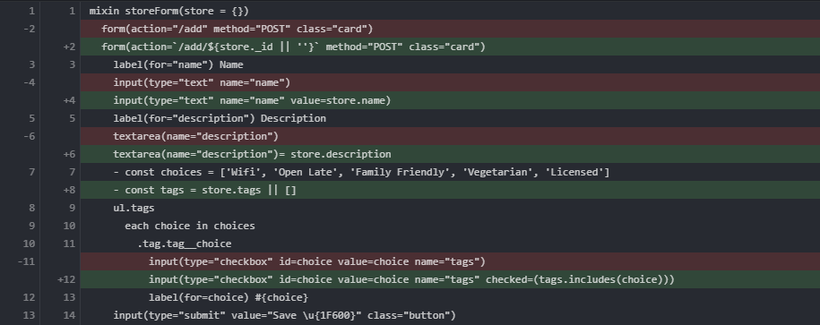

## Overview

- [Async/Await and Error Handling](#async-await)
- [Flash Messages](#flash-messages)
- [Querying Database](#querying-database)
- [The Edit Store Flow](#edit-store)

<h3 id="async-await">Async/Await and Error Handling</h3>

We make our `storeController.createStore` do this:

```js
exports.createStore = async (req, res) => {
  const store = new Store(req.body)
  await store.save()
  console.log('It worked')
}
```

And voila, the function stops at the line `await`-ing `store.save()`. The
`console.log` doesn't fire until `store.save()` is resolved.

Now for error handling we could wrap the body of our function in a `try` method, and `catch` any errors after. But we are going to be doing it so often, we will use a wrapper function called `catchErrors` from our `handlers/errorHandlers.js`.

In `routes/index.js` we alter the route like so:

```js
router.post('/add', catchErrors(storeController.createStore))
```

Now the `catchErrors` function looks like so:

```js
exports.catchErrors = fn => {
  return function(req, res, next) {
    return fn(req, res, next).catch(next)
  }
}
```

When it calls `next`, it's because the original function failed (so no hitting a route for you), and now you will hand off to the next series of operations in `app.js` (the other errorHandlers).

<h3 id="flash-messages">Flash Messages</h3>

This is some middleware usage that lets us easily throw up little notifications. Let's break this down:

1.  We use the flash in our storeController:

    ```js
    exports.createStore = async (req, res) => {
      const store = await new Store(req.body).save()
      req.flash(
        'success',
        `Successfully created ${store.name}.
        Care to leave a review?`
      )
      res.redirect(`/store/${store.slug}`)
    }
    ```

2.  The flash gets added to our res.locals.flashes in `app.js`:

    ```js{4}
    app.use(flash())
    // pass variables to our templates + all requests
    app.use((req, res, next) => {
      res.locals.h = helpers
      res.locals.flashes = req.flash()
      res.locals.user = req.user || null
      res.locals.currentPath = req.path
      next()
    })
    ```

3.  We render it in `layout.pug`, and styling it is up to us too.

    ```pug
    block messages
      if locals.flashes
        .inner
          .flash-messages
            - const categories = Object.keys(locals.flashes)
            each category in categories
              each message in flashes[category]
                .flash(class=`flash--${category}`)
                  p.flash__text!= message
                  button.flash__remove(onClick="this.parentElement.remove()") &times;
    ```

4.  We have a nifty helper function called `dump()`:

    ```js
    exports.dump = obj => JSON.stringify(obj, null, 2)
    ```

    which we could add to the block above, right below `.inner`, like so:

    ```pug
    pre= h.dump(locals.flashes)
    ```

    And it just slaps some JSON into your response, which looks like this:



<h3 id="querying-database">Querying the Database</h3>

We add this hush-puppy to our `storeController`:

```js
exports.getStores = async (req, res) => {
  // 1. Query database for all stores
  const stores = await Store.find()
  res.render('stores', { title: 'Stores', stores })
}
```

`find()` can take some parameters, and later we get into that. Defaults to 'find all of them suckers'.

And we will make both the homepage and the stores page go to our stores view in our `routes`:

```js
router.get('/', catchErrors(storeController.getStores))
router.get('/stores', catchErrors(storeController.getStores))
```

We wrap in `catchErrors` because `getStores` is an async function and you never can tell with those folks.

Just like earlier in [Learning-Node #4 Mixins](/posts/learning-node/mixins), we create a mixin template called `_storeCard.pug` and it will recieve a store object as an argument from its parent template, `stores.pug`

So our mixin looks like so, take note of how the image source attribute works, and how nice that is for providing a default picture:

```pug{6,7,12}
mixin storeCard(store = {})
  .store
    .store__hero
      .store__actions
        .store__action.store__action--edit
          a(href=`/stores/${store._id}/edit`)
            != h.icon('pencil')
      img(src=`/uploads/${store.photo || 'store.png'}`)
      h2.title
        a(href=`/store/${store.slug}`) #{store.name}
    .store__details
      p= store.description.split(' ').slice(0, 25).join(' ')
```

Notice also the highlighted lines above. They deal with these three things:

1.  ### store.\_id

    The first references `store._id`, and we find that mongoDB automatically gives each piece of data a unique `_id` value. How convenient! W will clarify how it got into the URL when we use params in our route. (a lot like with react-router)

2.  ### inserting an icon

    The second highlighted line uses a `helpers.js` function that goes like so:

    ```js
    // in helpers.js file
    exports.icon = name => fs.readFileSync(`./public/images/icons/${name}.svg`)
    ```

    This handy method of inserting the svg code keeps it all in the same http request, reducing the number of server requests.

3.  ### array methods to trim string

    ```js
    anySentence
      .split(' ')
      .slice(0, 25)
      .join(' ')
    ```

    If someone were to enter a really long description, it would break our design because we want all the store Cards to be the same size. So we limit the description to the first 25 words. Pretty slick...

And our stores template, with a super neat loop in it, looks like so:

```pug
extends layout

include mixins/_storeCard

block content
  .inner
  h2= title
  .stores
    each store in stores
      +storeCard(store)
```

So now, when we npm boogie, we get a nice stores homepage that Mr. Bos has already written wonderful CSS for. Spanx Bos-Man :)



<h3 id="edit-store">The Edit Store Flow</h3>

#### The general idea here

So we officially hit the `stores` route, get sent to a controller who says query the database for all our stores, then pass a template name and the stores along, and the pug template can access the passed params.
If we click the edit button on a `storeCard` in our `stores` view, it links us to `/stores/${store._id}/edit`. This is an edit form, just like for adding a store, but we will make it populate the form with the store we are editing. When we submit, it updates the store, redirects us back to the same edit page, and then flashes success (with a link to the store page).

#### The steps!

We'll add the following routes to handle that:

```js
router.post('/add/:id', catchErrors(storeController.updateStore))
router.get('/stores/:id/edit', catchErrors(storeController.editStore))
```

That `:id` is called a wild-card, pretty straight forward: Whatever is there is accessible in the controller as `req.params.id`. Below are our controller methods, so you can see how it works:

```js
exports.editStore = async (req, res) => {
  // 1. Find store, given ID
  const store = await Store.findOne({ _id: req.params.id })
  // 2. Confirm they are owner of store
  // TODO when we study sessions/auth
  // 3. Render edit form for user
  res.render('editStore', { title: `Edit ${store.name}`, store })
}

exports.updateStore = async (req, res) => {
  //find and update the store
  //then send them back
  //to the edit form
  const store = await Store.findOneAndUpdate({ _id: req.params.id }, req.body, {
    new: true, //return the new store, not the old one
    runValidators: true, //so someone can't update a store to have invalid fields
  }).exec()
  req.flash(
    'success',
    `Successfully updated <strong>${store.name}</strong>.
  <a href="/store/${store.slug}">View Store</a>`
  )
  res.redirect(`/stores/${store._id}/edit`)
}
```

When we pass our store to the storeForm, we want the form to display the values of the store, not just a blank form like for a new store. Below is an image from my git commit. If you've never seen one before, the red lines are what was 'removed' from the code, and the green lines have been added.



On line +2, we use the store object or default to an empty string.
On line +4, the value attribute defaults to an empty string.
On line +6, the html we are setting it to will be null.
On line +8, we make sure it defaults to an empty array, because later on line +12 we will error if we try to run `checked=(tags.includes(choice))` and tags is not an array.

So that's our awesome editing store flow!

On to [#6: Geolocation](/posts/learning-node/geolocation)!
