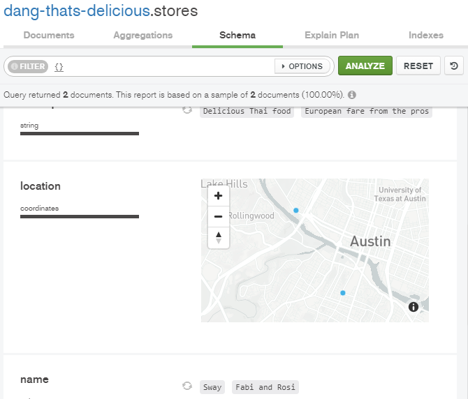

## Update our schema

We add to our schema in `models/store.js` because we are going to add a date the store was created/added, some geo-coordinates, and an address:

```js{13-100}
const storeSchema = new mongoose.Schema({
  name: {
    type: String,
    trim: true,
    required: 'Please enter a store name!',
  },
  slug: String,
  description: {
    type: String,
    trim: true,
  },
  tags: [String],
  created: {
    type: Date,
    default: Date.now(),
  },
  location: {
    type: {
      type: String,
      default: 'Point',
    },
    coordinates: [
      {
        type: Number,
        required: 'You must supply coordinates!',
      },
    ],
    address: {
      type: String,
      required: 'You must supply an address',
    },
  },
})
```

## Update our storeForm

Then we must add these fields to our `storeForm.pug`.

```pug
label(for="address") Address
input(type="text" id="address" name="location[address]"
value=(store.location && store.location.address))

label(for="lng") Address longitude
input(type="text" id="lng" name="location[coordinates][0]"
value=(store.location && store.location.coordinates[0])
required)

label(for="lat") Address latitude
input(type="text" id="lat" name="location[coordinates][1]"
value=(store.location && store.location.coordinates[1])
required)
```

## Nested data in our form inputs

Important to note, `location` in our schema has subfields `coordinates` and `address`. So when we get the data from the form in `req.body`, the address will be at `location.address`, that's why we do `name="location[address]"` in our `storeForm`.

In `app.js` we use the following feature of express, which with `{extended: true}` allows our input elements to have nested data:

```js
// Takes the raw requests and turns them into usable properties on req.body
app.use(bodyParser.json())
app.use(bodyParser.urlencoded({ extended: true }))
```

When we add a new store, we fill out everything and the address field, it creates the store, great.

When we go to edit this store, it doesn't fill in the address field for us. We have to add that like we did for the other fields. But, if we try to access `.address` while `location` is undefined, we will error out.

`value=(store.location && store.location.address)`

This conditional will check if `store.location` exists, and then that `store.location.address` exists, and then default returns the last found true. If false, it just returns false. Cool trick :)

Then we will connect to Google Maps so once we enter an address, it will populate the coordinates for us.

## Geocoding data with Google Maps

We are looking at `public/javascripts/modules` where there is already `delicious-app.js` in the javascripts folder, and it imports some scss and `bling` from the modules folder.

You can kind of see how bling lets you shorthand your query selectors and event listeners.

We are going to create a new module that uses the google maps API. We create it in the `modules` directory, and call it `autocomplete.js`.

We add to our `delicious-app.js` the following lines, notice how we are feeding our import some blinged out elements, selected from our page by their element ID's:

```js
import autocomplete from './modules/autocomplete'
autocomplete($('#address'), $('#lat'), $('#lng'))
```

In `autocomplete.js` we make a function that goes like so:

```js
function autocomplete(input, latInput, lngInput) {
  if (!input) return //skip it if no input on page
  const dropdown = new google.maps.places.Autocomplete(input)
  dropdown.addListener('place_changed', () => {
    const place = dropdown.getPlace()
    latInput.value = place.geometry.location.lat()
    lngInput.value = place.geometry.location.lng()
  })
  // If someone hits 'enter' on the address field,
  // don't submit the form
  // because it's easy to press enter
  // in the google autocomplete dropdown
  input.on('keydown', e => {
    if (e.keyCode === 13) e.preventDefault()
  })
}

export default autocomplete
```

## Quick data visualization tip

There is the fact that, when you add a new store with a location, its type will be 'Point'. But when you update a store that doesn't have that, it doesn't assign it the default value of type: 'Point', to change that we have to go in our `storeController.exports.updateStore`:

```js
exports.updateStore = async (req, res) => {
  //set location data to be a 'point'
  //in case its data older than the
  //updated schema
  req.body.location.type = 'Point'
  // ...the rest of updateStore
}
```

MongoDB Compass gives me a pretty picture of my data, when it's properly marked as location points:



Next in [#7: File Uploads](/posts/learning-node/file-uploads) we learn how to let users upload a photo for a restaurant, and how to make sure we only accept the right file types, and store them correctly.
