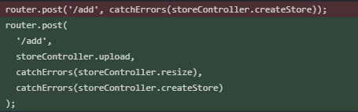

## Upload photos of our stores

We are going to upload an image file, and we are going to resize that image file.

### Update schema / Add the middleware to the route

Add a line to our store model, `photo: String,` because we are going to buffer the photo into text.

In our `routes`, we will alter the createStore and updateStore routes to include two new exports from `storeController`.

Out with the red and in with the green::



### Add the middleware to the storeController

In `storeController.js` we must import some things:

- [Multer](https://www.npmjs.com/package/multer), for handling multipart/form-data.
- [jimp](https://github.com/oliver-moran/jimp), for processing the image.
- [uuid](https://www.npmjs.com/package/uuid), for generating (probably) unique names. It generates a 128-bit number, with a nice, long textual string representation.

#### uuid

How unique is a UUID? For the probability of finding a collision to be one in a billion, 103 trillion version 4 UUIDs must be generated!

#### multer

Look at the multerOptions object we create:

```js
const multerOptions = {
  storage: multer.memoryStorage(),
  fileFilter: function(req, file, next) {
    const isPhoto = file.mimetype.startsWith('image/')
    if (isPhoto) {
      next(null, true)
    } else {
      next({ message: "That filetype isn't allowed!" }, false)
    }
  },
}
```

So we use the destination/storage option, and the file filter option. We invoke multer like so:

```js
exports.upload = multer(multerOptions).single('photo')
```

#### jimp

We used multer to handle the file upload. It gives us an easy to use `req.file`, and jimp promised us that it would return that picture we gave it. Jimp would never flake on us.

Also, look how easy that uuid API is. I love it!

```js
exports.resize = async (req, res, next) => {
  // check if there is no new file to resize
  if (!req.file) {
    next() // skip to next middleware
    return
  }
  // verify mimetype, file name isn't trustworthy
  const extension = req.file.mimetype.split('/')[1]
  // unique file name, please
  req.body.photo = `${uuid.v4()}.${extension}`
  // now we resize
  const photo = await jimp.read(req.file.buffer)
  await photo.resize(800, jimp.AUTO)
  await photo.write(`./public/uploads/${req.body.photo}`)
  //once we have written the file to our filesystem, keep going!
  next()
}
```

### The storeForm, much ado about 'photo'

In our `storeForm.pug` we must give our form element an `enctype="multipart/form-data"` attribute.

We also add to the form a section for uploading the image:

```pug
//- Image Upload
label(for="photo") Photo
  input(type="file" name="photo" id="photo" accept="image/gif, image/png, image/jpeg")
  if store.photo
    img(src=`/uploads/${store.photo}`, alt=store.name width=200)
```

In [#8: Review](/posts/learning-node/review) we do a quick recap of a process we have repeated several times: make a route, then use the controller to render a view.
