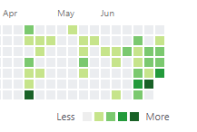

I definitely fell out of the saddle for awhile. Life got full and very little time was spent coding or learning for over a month.

When I first created this blog back in April, I felt like I was learning so much, so fast, and I was having so much fun with Gatsby and exercising my
elementary understanding of React. Some of the CSS I was writing at the time wasn't garbage, and I made the first thing I was personally proud of and excited to share (the heroscape app). I felt like I finally understood my git workflow, as opposed to just using git.

But soon after, and through the month of May, I just was not coding nearly as much as prior. I felt like every day I knew less about what the hell was going on in my repositories and codebases. I'd open some projects and just be dumbfounded about how I'd made it or what I was aiming for. The idea of designing an app or site all the way through seemed so **daunting** and unapproachable.

In June, tired as hell from late nights waiting tables, I swore to myself something along the lines of

<blockquote>
One git commit every day. Code every day, and it will become much more natural.
</blockquote>

I wanted my commit history calendar on github to be as green as possible. And eventhough it took me a couple weeks to ramp up, I did manage to gather a lot of momentum:

It's been easy and addicting. I launched my [sister's business website](https://eat-2-petite.com/), built on Wordpress. I got an account for [LevelUpTutorials](https://www.leveluptutorials.com/), and went through the ProGatsby course. It woke up the knowledge, and got me back into playing with Gatsby. Of course I got pumped about my own blog again, and kept up little side projects and tutorials regarding React, React-Router, CSS-Grid and Modern CSS Layouts. I could tell that it was all coming back to me so fast, and the passion in me had been rekindled during my hiatus.

Every morning I wake up and can't wait to get to work, to play with my code and learn new things. And every night after work I am right back at it until I can't keep my eyes open.

This blog is taking form, my understanding of React is starting to feel robust, and I just started learning Node. I am on such a roll, honeybear!
