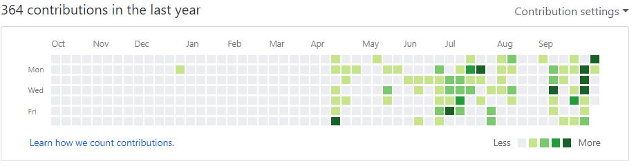

In January, when I decided I was going to 'learn to build websites', I was working with a lot less knowledge. So many unfamiliar terms and relationships and technologies, it was so overwhelming how much I didn't know.

I definitely won't claim that I'm an amazing developer now, or that I know it all. That's obviously false.

But you know what's true? I can totally write beautiful code.

I may not achieve it in every program I write, and I certainly can't do it consistently on the first try.

But I know what good code is, I've read some. I've read about it. I've read bad/sloppy code. I have refactored past projects, and incorporated SOLID principals into my approach.

I just finished my first lesson on Node, I am going to my first hackathon in November ([Developer Week in Austin, TX, don't miss it!](http://www.developerweek.com/Austin/)), I have remade the Heroscape-Armory app and it's now a maintainable and extendable codebase.

I recently spoke to a couple of recruiters and they definitely gave me the impression that I was not hireable until I have more experience, so today I am going to get rocking on a freelancer.com account and see if I can't get some experience working on other peoples' code!

Furthermore, [it is Hacktober!](https://hacktoberfest.digitalocean.com/) and I encourage all you hackers to get out there and contribute to open source! I know I will, even if all I am really capable of confidently helping with is documentation, I've been told that that is perfectly helpful to the community!

In sum, everything is going so well, I have come so far and run into far fewer 5-hour bugs or road-blocks. I wish so bad that I could get paid to do this work instead of food service, but that's life!

Keep hacking, right?

